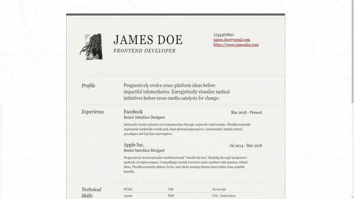

# CVcraft

CVcraft is a web-based CV and portfolio generation platform that allows users to create, customize, and manage professional resumes and portfolios effortlessly. The platform provides multiple templates and export options to help users showcase their expertise effectively.

## Features
- **User Authentication** – Secure registration and login system.
- **Customizable CV & Portfolio Templates** – Choose from a variety of designs.
- **Instant Editing** – Modify content with a user-friendly editor.
- **Export & Download** – Save CVs as PDFs and portfolios as static HTML/CSS.
- **Responsive Design** – Optimized for desktops, tablets, and mobile devices.

## Tech Stack
- **Frontend:** HTML, CSS, Javascript, Thymeleaf
- **Backend:** Java, Spring Boot, Maven
- **Database:** PostgreSQL, Docker

## Demonstration

  
  
  

## License
This project is licensed under the [MIT License](LICENSE).